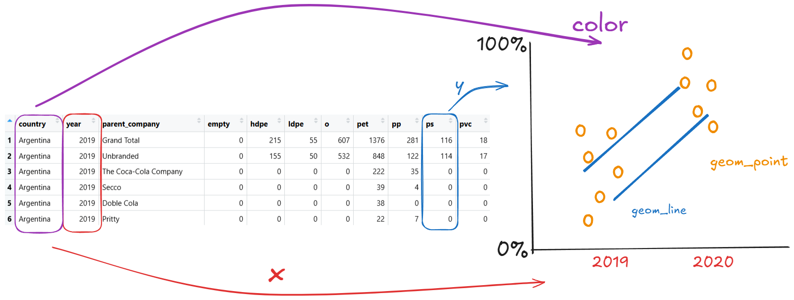

# Introduction

This Plastic Waste dataset is provided by [Break Free From Plastic](https://www.breakfreefromplastic.org/). Sarah Sauve was volunteering for her local Zero Waste Action Team when one of her colleagues proposed a local brand audit in St. Johns to contribute to the global audit as well as a larger project that was about understanding the sources of plastic in their city. She then used the 2019 and 2020 global audit data online and did some data cleaning and wrangling to better understand the global plastic pollution issue. User jonthegeek then used the same raw data prepped the data set in his own way.\

Here is a snippet of the data set:

```{r}
plastics <- read.csv("C:/Users/sansk/Downloads/cal poly/sophomore year/spring 2026/STAT 431/Plastic-Waste-Analysis/plastics.csv")

head(plastics)
```
Data from both 2019 and 2020 is included. This data was measured through volunteers physically collecting pieces of plastic and recording the type of plastic and company label. The observational unit here is one brand/company audited in one country in one year, described by the following variables:

- **country:** where the brand audit was conducted
- **year:** year of the audit, 2019 or 2020
- **parent company:** The company whose plastic waste was counted. "Unbranded" represents plastic without a known or identifiable brand.
- **empty:** number of unlabeled pieces of plastic
- **hdpe:** number of High-Density Polyethylene pieces
- **ldpe:** number of Low-Density Polyethylene pieces
- **o:** number of "other" types of plastic pieces that don't fall into the other categories
- **pet:** number of Polyethylene Terephthalate pieces
- **pp:** number of Polypropylene pieces
- **ps:** number of Polystyrene pieces
- **pvc:** number of Polyvinyl Chloride pieces
- **grand total:** the total count of plastic pieces across all types for that country/brand/year audit
- **num_events:** the number of clean-up events held
- **volunteers:** the number of volunteers who participated in the audit

# Data Cleaning
jonthegeek used janitor to clean the data. He...

- used janitor::clean_names() to standardize the column names without changing them manually,
- converted grand_total into a character to deal with the commas that were included in the numbers and then removed the commas,
- used set_names() and map_dfr() to with the .id argument to create the country column,
- dropped duplicate pp and ps columns using select(), and
- added a year column using rbind() to combine the 2019 and 2020 data into one data set.

# Explorations

## RQ 1: Does plastic type composition vary systematically by region?

Differences in PET vs. HDPE vs. PP across regions could reflect underlying patterns in local markets and waste infrastructure.

## RQ 2: Do the same big brands keep showing up together in the same countries?

Major, multi-national brands like Coca-Cola and Nestle appear across almost all countries. However, if they consistently cluster within the same countries, it could suggest that some markets are hotspots for plastic pollution, and spark the conversation of why that would be.

# Visualizations




